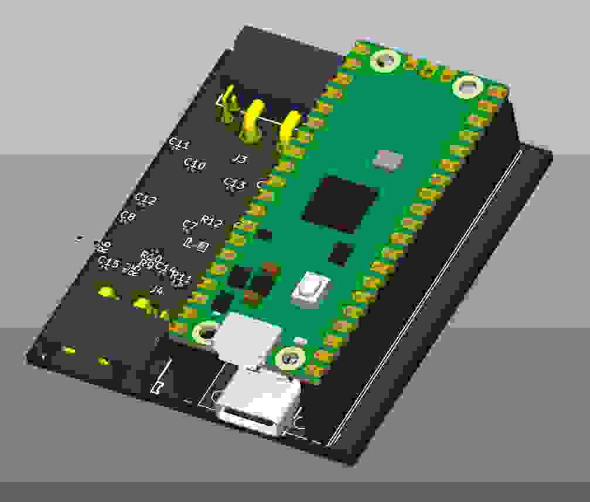

<div align="center">

# HyperPD


<br/>

HyperHDR LED controller with USB-PD power input 

[](https://github.com/ruben-iteng/hyperpd/releases) [](https://github.com/ruben-iteng/hyperpd/blob/main/LICENSE) [](https://github.com/ruben-iteng/hyperpd/pulls) [](https://github.com/ruben-iteng/hyperpd/issues) [](https://github.com/ruben-iteng/hyperpd/commits/main)

</div>

## About

HyperPD is a HyperHDR compatible LED controller with USB-PD as power source. By using XT30 connectors with 2 additional data pins, you can use pre-assembled cables that you only need to solder to your LED strip! All these features make this a very compact and easy to connect solution.

### Features

- USB-C PD power input (15V and 20V)
- 5V @ 8A continuous output for the LEDs
- XT30(2x2) connectors for easy connection to the LED strips
- Support for SPI and WS2812/SK6812 LED strips
- Support for multi-segment LED strip setups
- 100% compatible with HyperSerialPico firmware

## Making your own

Buy the following components:

- Raspberry Pi Pico (or pin compatible board)
- USB-C PD Power Supply
  - This board supports 15V and 20V power input
  - Match the wattage with your LED strip, higher wattage is okay/better
- 1 or 2 [XT30 cables](https://www.aliexpress.com/item/1005007527109751.html)
- The HyperPD board (order the assembled board on JLCPCB or make your own)
- 3D printed case (optional, see [here](./mechanical/README.md))

## Firmware

Firmware informationcan be found [here](./firmware/README.md).

## Mechanical

Files for a 3D printable case can be found [here](./mechanical/README.md).

## Development

Setup atopile:

- Guide can be found [here](https://docs.atopile.io/).


Build the project:

```bash
# In the root of the project
# Using uv to install the dependencies
uv sync
uv run pip install -e .
# Local install is needed for local fabll module imports
```

Build the project default target to generate release artifacts (Gerber, STEP, BOM, P&P,etc.):
```bash
# In the root of the project
atopile build
```